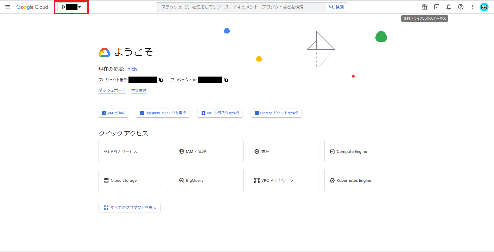

# Sample Google OAuth 2.0


## インフラ構成図


## シーケンス図

- English


- 日本語


このシーケンス図は、ユーザーが `Google OAuth 2.0` を使ってReactアプリケーションにログインするプロセスです。

以下に各ステップを詳しく解説します。

**User->>ReactApp: 1. Login Request**: 

ユーザーがReactアプリケーションにログインリクエストを送ります。これは通常、ログインボタンをクリックすることで起こります。

**ReactApp->>Google: 2. Request Authorization Code**: 

Reactアプリケーションは、ユーザーのログインリクエストを受け取った後、Googleサーバーに認証コードのリクエストを送ります。これはOAuthの一部で、ユーザーの同意を得るためのステップです。

**Google->>User: 3. Prompt User for Login Information**: 

Googleサーバーは、ユーザーにログイン情報（メールアドレスとパスワード）の入力を求めます。これはGoogleのログインページで行われます。

**User->>Google: 4. User Enters Login Information**: 

ユーザーは要求されたログイン情報（メールアドレスとパスワード）をGoogleに提供します。

**Google->>ReactApp: 5. Return Authorization Code**: 

ユーザーが正しくログイン情報を提供した後、Googleはその認証に対する認証コードをReactアプリケーションに返します。

**ReactApp->>Express: 6. Request User Info**: 

Reactアプリケーションは、認証コードをExpressサーバーに送信し、ユーザー情報を要求します。

**Express->>Google: 7. Request Access Token with Authorization Code**: 

Expressサーバーは、受け取った認証コードを使ってGoogleサーバーにアクセストークンを要求します。これはOAuthの一部で、ユーザー情報へのアクセス許可を得るためのステップです。

**Google->>Express: 8. Return Access Token**: 

Googleサーバーは、認証コードが正しく検証された後、Expressサーバーにアクセストークンを返します。

**Express->>Google: 9. Request User Info with Access Token**: 

Expressサーバーは、受け取ったアクセストークンを使ってGoogleサーバーにユーザー情報を要求します。

**Google->>Express: 10. Return User Info**: 

Googleサーバーは、アクセストークンが有効であれば、要求されたユーザー情報をExpressサーバーに返します。

**Express->>ReactApp: 11. Return User Info**: 

Expressサーバーは取得したユーザー情報をReactアプリケーションに返します。これにより、Reactアプリケーションは認証されたユーザー情報を手に入れます。

**ReactApp->>User: 12. Display User Info**: 

最後に、Reactアプリケーションは取得したユーザー情報を表示します。


## 環境構築

### 使用技術とバージョン

| 技術   | バージョン   |
| ------- | ------- |
| Node.js | v18.12.1 |
| React | 18.2.0 |
| Express | 4.18.2 |


### クライアントIDとクライアントシークレット発行

1. [Google Cloud](https://console.cloud.google.com/welcome)にアクセスする



2. 左上の「プロジェクトの選択」から「新しいプロジェクト」を押下する


3. 「プロジェクト名」を入力し、「作成」を押下する
    - プロジェクト名: `任意`


4. 作成したプロジェクトを選択し、`APIとサービス > OAuth 同意画面` を開く


5. `User Type` は `外部` を選択し、「作成」を押下する


6. 「アプリ名」、「ユーザーサポートメール」、「アップロードするロゴファイル」、「メールアドレス」を入力し、「保存して次へ」を押下する
    - アプリ名: `必須`
    - ユーザーサポートメール: `必須`
    - アップロードするロゴファイル: `任意`
    - メールアドレス: `必須`


7. 「保存して次へ」を押下する


8. 「保存して次へ」を押下する


9. 「ダッシュボードに戻る」を押下する


10. `認証情報 > 認証情報を作成 > OAuthクライアントID` を開く


11. 「アプリケーションの種類」、「名前」、「承認済みのJavaScript生成元」、「承認済みのリダイレクトURI」を入力し、「作成」を押下する
    - アプリケーションの種類: `任意`
    - 名前: `任意`
    - 承認済みのJavaScript生成元: `http://localhost:3000`
    - 承認済みのリダイレクトURI: `http://localhost:3000`


12. `クライアントID` と `クライアントシークレット` をメモする


### AWS Lambdaを作成する

1. AWS マネジメントコンソールから「Lambda」を検索する


2. 「関数の作成」を押下する


3. 「一から作成」を選択し、「関数名」、「ランタイム」、「関数URL有効化」、「認証タイプ」を入力して「関数の作成」を押下する
    - 関数名: `必須`
    - ランタイム: `Node.js 18.x`
    - 関数URL有効化: `チェック`
    - 認証タイプ: `NONE`


4. `関数URL` をメモする


### ソースコードをデプロイ

1. ソースコードをローカルに保存する

- コマンド
```
git clone https://github.com/ryomeblog/google-oauth.git
cd google-oauth
```

2. ライブラリ等をインストール

- Reactコマンド
```
cd ./frontend/sample-oauth/
npm install --legacy-peer-deps
cd ../../
```

- Expressコマンド
```
cd ./backend/
npm install
cd ..
```

3. backendの中身をzipファイル化する

- zipファイル化コマンド
```
cd backend
zip -r FILENAME.zip .
```


4. Lambdaにソースコードデプロイ


### 環境変数設定

1. Lambdaの環境変数を設定する
    - FRONT_URL: `http://localhost:3000`
    - GOOGLE_CLIENT_ID: `【クライアントID】`
    - GOOGLE_CLIENT_SECRET: `【クライアントシークレット】`


2. Reactの `.env` ファイルを設定する
    - パス: `google-oauth/frontend/sample-oauth/.env`

- .envファイル
```
REACT_APP_GOOGLE_CLIENT_ID=【クライアントID】
REACT_APP_API_URL=【関数URL】
```

※ 【関数URL】は、最後の「/」がいらない

## アプリケーション起動

1. 「npm start」コマンドでアプリケーションを起動する

- コマンド
```
cd ./frontend/sample-oauth
npm start
```

2. 「Sign in with Google」を押下し、ログインを行う 


3. ログイン後、ユーザ情報が表示されれば成功


